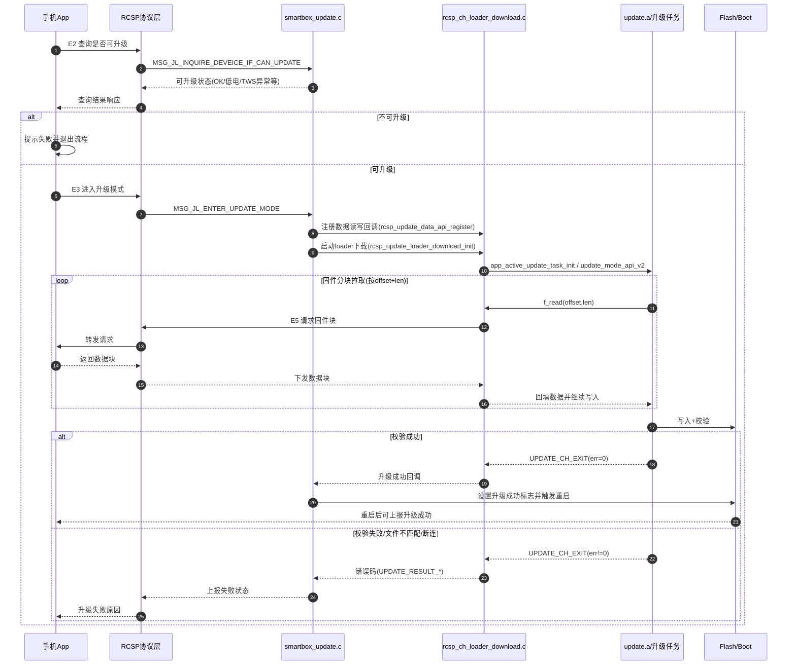

# JL701N Smartbox OTA 原理讲解（基于当前工程）

## 1. 目标与边界
本文说明当前 `watch/smartbox` 工程里的 OTA 工作机制，不新增协议、不改底层库，重点是理解现有升级链路如何跑通。

---

## 2. 整体架构

当前工程 OTA 不是从零实现，而是“业务层 + SDK升级库”组合：

- **业务控制层（Smartbox/RCSP）**
  - 负责接收手机侧升级指令、状态机推进、连接管理
  - 典型文件：`smartbox_update.c`、`smartbox_rcsp_manage.c`
- **通道适配层（RCSP通道读写）**
  - 负责按 offset/len 拉取固件块、回传升级状态
  - 典型文件：`rcsp_ch_loader_download.c`
- **升级执行层（SDK update）**
  - 负责 loader 下载、flash 写入、校验、升级结果落盘、重启切换
  - 典型接口：`update_mode_api_v2()`、`app_active_update_task_init()`

---

## 3. OTA 主流程（逻辑顺序）

1. 手机端发起升级能力查询（RCSP OpCode）。
2. 设备判断是否可升级（连接状态、电量策略、TWS状态等）。
3. 进入升级模式（`ENTER_UPDATE_MODE`）。
4. 注册数据回调与状态回调（通道层）。
5. 启动 loader 下载（`rcsp_update_loader_download_init(...)`）。
6. SDK 升级任务循环读取固件块并写入 flash。
7. 校验通过后设置升级成功标志，触发重启/跳转。
8. 启动后读取升级结果并上报。

## 3.1 OTA 时序图（主流程 + 关键失败分支）

---

## 4. 关键机制说明

### 4.1 指令面
升级相关 OpCode 已固定（`0xE1 ~ 0xE8`），包括：
- 获取升级文件信息偏移
- 查询是否可升级
- 进入/退出升级模式
- 请求固件分块
- 获取刷新状态
- 设置重启

### 4.2 数据面
升级库通过通道回调按 `offset + len` 拉数据，业务层从 RCSP 通道取到数据后回填给升级任务。

### 4.3 结果面
升级错误被归一到 `UPDATE_RESULT_*`（文件不匹配、校验失败、资源不足、TWS异常等），最终转换成对手机可理解的状态码。

---

## 5. 配置与模式要点

- `RCSP_UPDATE_EN`：是否启用 RCSP 升级入口
- `CONFIG_APP_OTA_ENABLE`：post-build OTA 能力配置
- `CONFIG_DOUBLE_BANK_ENABLE`：单备份/双备份策略选择
- `RCSP_CHANNEL_SEL`：升级控制通道（BLE/SPP）

> 注意：这些配置必须“成套一致”，否则容易出现“可连接但不能升级”或“升级后不跳转”。

---

## 6. 稳定性关注点（嵌入式重点）

- 升级期间连接切换必须可控（BLE/SPP断连、超时重试）。
- 升级任务不能被高优先级任务长期饿死。
- 不在高频路径打印大量日志，避免影响时序。
- 错误必须显式返回/上报，禁止 silent failure。
- 升级完成前避免触发与 flash 操作冲突的业务。

---

## 7. 你这个工程里“最实用”的理解

你不需要“重写 OTA 协议栈”，而是：

1. 选定升级模式（single/dual bank）  
2. 选定通道（BLE/SPP/UART）  
3. 确保配置一致  
4. 复用现有 RCSP 升级状态机  
5. 做好异常路径和结果回传

这样改动最小、风险最低、最符合当前项目稳定性要求。
